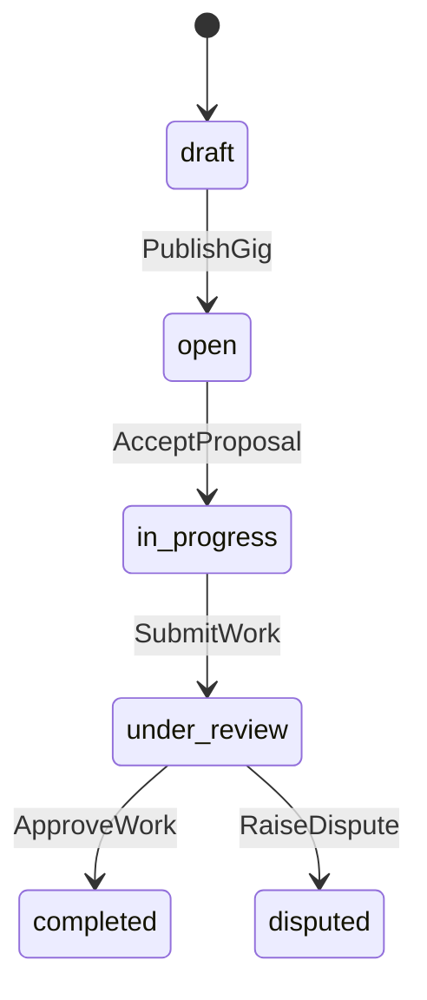
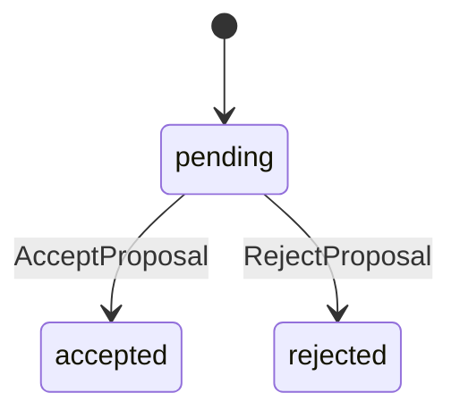

# GigBridge — 더미 프로젝트 명세

## 1. Domain Overview

GigBridge는 프리랜서 에스크로 매칭 플랫폼입니다. Client가 프로젝트(Gig)를 등록하고, Freelancer가 제안(Proposal)을 제출하며, Client가 작업을 승인할 때까지 에스크로에 결제가 보관됩니다. 완료 시 10% 플랫폼 수수료가 차감됩니다.

## 2. Entity & DDL

- **users**: `id`, `email`, `password_hash`, `role` ('client', 'freelancer', 'admin'), `name`
- **gigs**: `id`, `client_id` (FK), `title`, `description`, `budget` (int), `status` (string), `freelancer_id` (FK, nullable), `created_at`
- **proposals**: `id`, `gig_id` (FK), `freelancer_id` (FK), `bid_amount` (int), `status` (string)
- **transactions**: `id`, `gig_id` (FK), `type` ('hold', 'release', 'refund'), `amount` (int), `created_at`

## 3. State Machine

### Gig States

### Proposal States

## 4. Authorization Rules

- `gig`: `gigs.client_id`
- `gig_assignee`: `gigs.freelancer_id`
- `proposal`: `proposals.freelancer_id`

| Operation | Condition |
|---|---|
| PublishGig | Role 'client' AND owns `gig` |
| SubmitProposal | Role 'freelancer' |
| AcceptProposal | Role 'client' AND owns `gig` |
| SubmitWork | Role 'freelancer' AND is `gig_assignee` |
| ApproveWork | Role 'client' AND owns `gig` |

## 5. API & Business Logic

- **POST /gigs** (`CreateGig`): Client only, `draft` 상태로 생성
- **PUT /gigs/{id}/publish** (`PublishGig`): `draft` → `open`
- **GET /gigs** (`ListGigs`): Public, `x-pagination`, `x-sort`, `x-filter`, `x-include`
- **POST /gigs/{id}/proposals** (`SubmitProposal`): Freelancer only
- **POST /proposals/{id}/accept** (`AcceptProposal`): Proposal `pending` → `accepted`, Gig `open` → `in_progress`, `@call billing.holdEscrow`
- **POST /gigs/{id}/submit-work** (`SubmitWork`): `in_progress` → `under_review`
- **POST /gigs/{id}/approve** (`ApproveWork`): `under_review` → `completed`, `@call billing.releaseFunds`, `@call mail.sendTemplateEmail`

## 6. Custom Functions

- `holdEscrow(gigID, amount, clientID)`: 에스크로 잠금 시뮬레이션, transaction ID 반환
- `releaseFunds(gigID, amount, freelancerID)`: 10% 수수료 차감, 90% 프리랜서에게 전달, transaction ID 반환

## 7. Frontend UI

- `gigs.html`: `data-fetch="ListGigs"`, `data-paginate`, `data-sort`, `data-filter`, `data-each`
- `gig-detail.html`: 상태 기반 액션 버튼 (`data-action`, `data-state`)

## 8. E2E Scenario

- **@scenario** Happy Path: Client Gig 생성 → Freelancer 제안 → Client 수락 → 에스크로 → Freelancer 작업 제출 → Client 승인 → 자금 정산
- **@invariant** Unauthorized Access: Freelancer B가 Freelancer A의 Gig에 SubmitWork → `403`
- **@invariant** Invalid State: Client가 `open` 상태 Gig에 ApproveWork → `409`

## 9. 개발 지침

1. `artifacts/AGENTS.md`, `artifacts/manual-for-ai.md` 참고
2. SSOT specs는 `specs/dummys/gigbridge-tryNN/`에 작성 (tryNN은 시도 번호)
3. 시작 시간을 기록하고 소요시간을 측정
4. 더미 메일은 `artifacts/scripts/dummy-smtp.py` 사용, DB는 도커로 실행
5. 다른 프로젝트를 참고하지 말고 매뉴얼만 숙지하고 개발
6. 이전 try(gigbridge-try01, try02 등)를 절대 참고하지 않는다. 매뉴얼만 보고 처음부터 새로 작성
7. fullend에 오류가 있더라도 수정하지 말고, 멈추지 말고 완수. 버그는 `files/bugs/BUGNNN.md`에 리포트.
8. 완료 후 `files/dummys/reports/gigbridge-report-n.md` 작성
9. PTY 쉘에서 `!`에 이스케이프 하므로 비밀번호에 사용금지.
