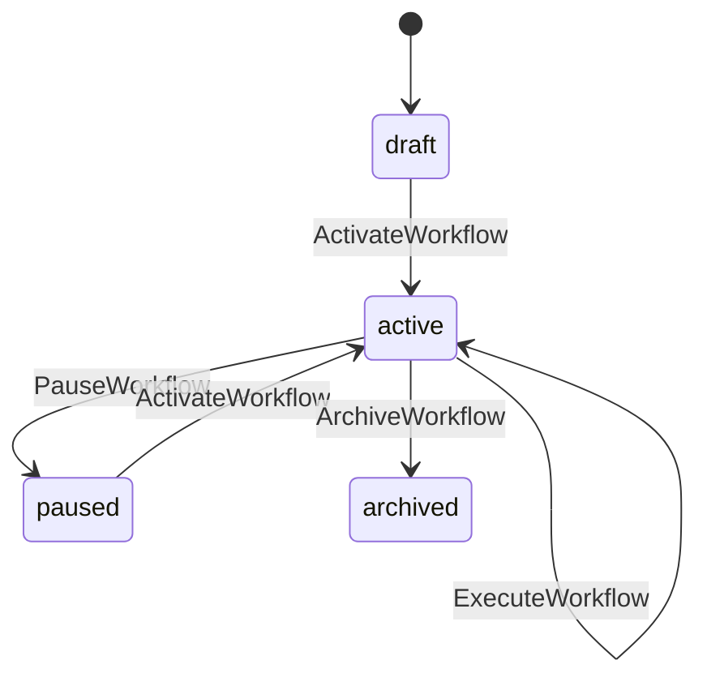

# WorkflowState

```mermaid
stateDiagram-v2
    [*] --> draft
    draft --> active: ActivateWorkflow
    active --> active: ExecuteWorkflow
    active --> paused: PauseWorkflow
    paused --> active: ActivateWorkflow
    active --> archived: ArchiveWorkflow
```
